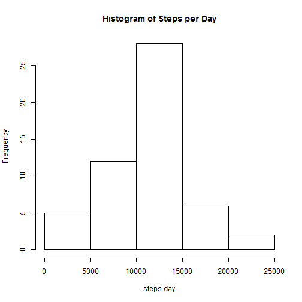
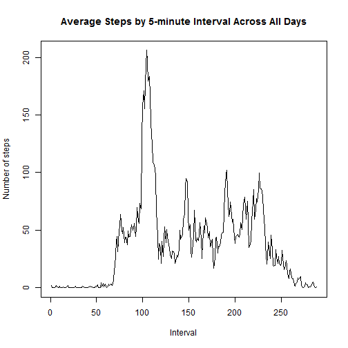
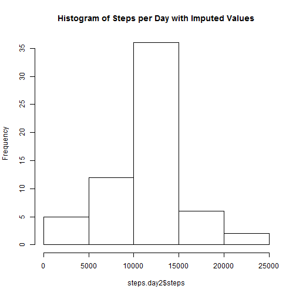

## Loading and preprocessing the data
1. Load the data 

```r
activity <- read.csv("activity.csv", as.is=TRUE)
```

2. Process/transform the data by changing the data in the date column to the **Date** class

```r
activity$date <- as.Date(activity$date)
```


## What is mean total number of steps taken per day?
1. Calculate the total number of steps taken per day

```r
steps.day <- tapply(activity$steps, activity$date, sum)
```

2. Make a histogram of the total number of steps taken each day

```r
hist(steps.day, main="Histogram of Steps per Day")
```

 

3. Calculate and report the mean and median of the total number of steps taken per day

```r
steps.mean <- mean(steps.day, na.rm=TRUE)
steps.median <- median(steps.day, na.rm=TRUE)
```
The mean and median of the total number of steps taken per day are 1.0766189 &times; 10<sup>4</sup> and 10765, respectively.


## What is the average daily activity pattern?
1. Make a time series plot of the 5-minute interval (x-axis) and the average number of steps taken, averaged across all days (y-axis)

```r
steps.interval <- tapply(activity$steps, activity$interval, mean, na.rm=TRUE)
plot(steps.interval, type="l", main="Average Steps by 5-minute Interval Across All Days", 
     xlab="Interval", ylab="Number of steps")
```

 

2. Find the 5-minute interval, on average across all the days in the dataset, contains the maximum number of steps

```r
steps.interval[order(steps.interval, decreasing=TRUE)[1]]
```

```
##      835 
## 206.1698
```

## Imputing missing values
1. Calculate and report the total number of missing values in the dataset (i.e. the total number of rows with NAs)

```r
sum(is.na(activity$steps))
```

```
## [1] 2304
```

2. Missing values (NAs) are replaced by the mean steps for that 5-minute interval

3. Create a new dataset that is equal to the original dataset but with the missing data filled in.

```r
activity.imputed <- activity
activity.imputed[is.na(activity$steps), "steps"] <- steps.interval[paste(activity[is.na(activity$steps), "interval"])]
```

4. Make a histogram of the total number of steps taken each day and Calculate and report the mean and median total number of steps taken per day. Do these values differ from the estimates from the first part of the assignment? What is the impact of imputing missing data on the estimates of the total daily number of steps?

```r
steps.day2 <- aggregate(steps ~ date, data=activity.imputed, sum)
hist(steps.day2$steps, main="Histogram of Steps per Day with Imputed Values")
```

 

```r
mean(steps.day2$steps)
```

```
## [1] 10766.19
```

```r
median(steps.day2$steps)
```

```
## [1] 10766.19
```
The mean value does not change because mean steps for 5-minuite interval is used to impute the missing values. The median value has changed because imputed data are included. 


## Are there differences in activity patterns between weekdays and weekends?
1. Create a new factor variable in the dataset with two levels - "weekday" and "weekend" indicating whether a given date is a weekday or weekend day.

```r
weekday <- rep(NA, nrow(activity.imputed))
weekday[weekdays(activity.imputed$date) %in% c("Sunday", "Saturday")] <- "weekend"
weekday[!(weekdays(activity.imputed$date) %in% c("Sunday", "Saturday"))] <- "weekday"
activity.imputed <- cbind(activity.imputed, weekday=as.factor(weekday))
```

2. Make a panel plot containing a time series plot (i.e. type = "l") of the 5-minute interval (x-axis) and the average number of steps taken, averaged across all weekday days or weekend days (y-axis).

```r
avg.steps.int2 <- aggregate(steps ~ weekday + interval, data=activity.imputed, mean)
library(lattice)
xyplot(steps ~ interval|weekday, data=avg.steps.int2, type="l", layout=c(1,2), 
       xlab="Interval", ylab="Number of steps")
```

 

Observations:
- The average number of steps peaks around 8am during both weekdays and weekends. 
- The peak number of steps is higher during weekdays than it during weekends.
- During rest of the day, the number of steps is lowser during weekdays than it during weekends.
